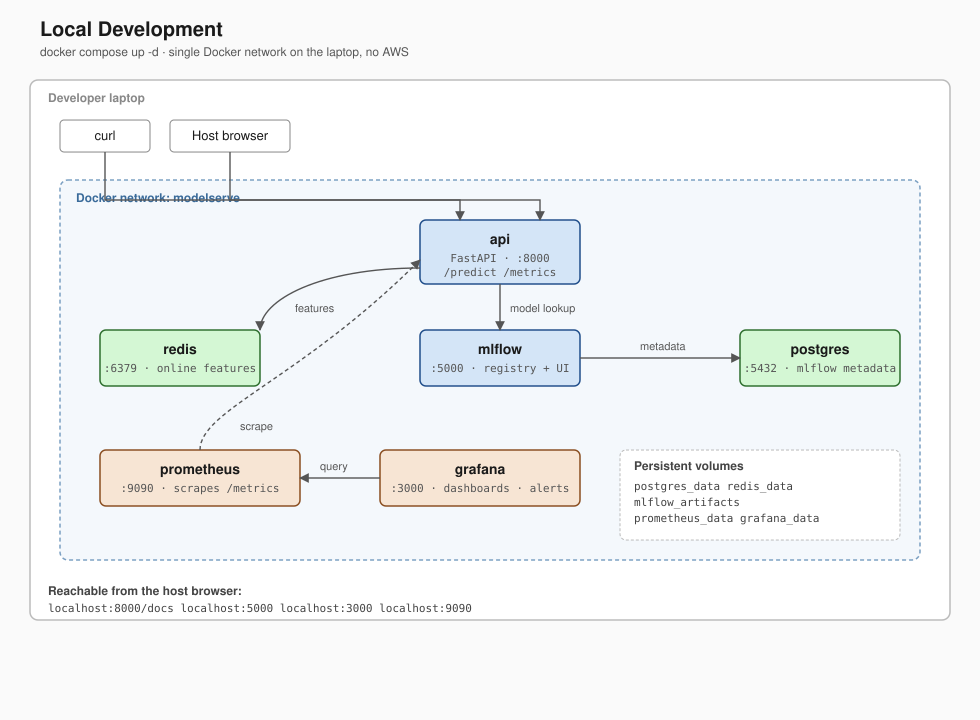
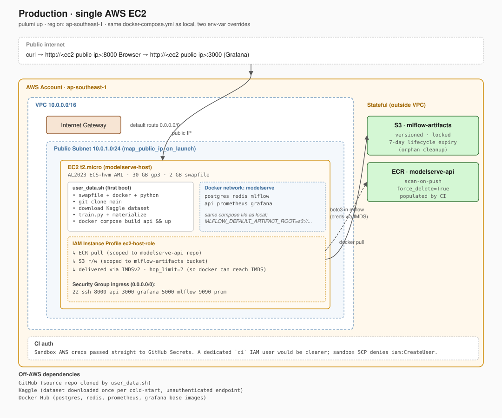

## 1. System Overview

ModelServe is an ML serving platform built around a fraud-detection model trained on the Sparkov synthetic transactions dataset ([Kaggle: kartik2112/fraud-detection](https://www.kaggle.com/datasets/kartik2112/fraud-detection)). The headline endpoint is `POST /predict`: takes a credit card number, fetches the cardholder's most recent feature snapshot from Redis through Feast, runs it through a sklearn `RandomForestClassifier` loaded from MLflow Registry, returns a fraud probability with the model version that produced it.

MLflow for experiment tracking, Feast for the feature store, Prometheus + Grafana for observability, Pulumi for AWS infrastructure, and GitHub Actions for CI/CD. Model quality is intentionally not the focus - the baseline RandomForest hits AUC ~0.97 and the rest of the effort goes into the operational surface.

The design philosophy is **simplicity over availability**: a single AWS EC2 instance runs the entire compose stack. No horizontal scaling, no multi-AZ, no load balancer. Single point of failure, fine for a sandbox demo. Postgres holds MLflow's experiment metadata, S3 holds MLflow's artifacts so they survive `pulumi destroy`, Redis holds Feast's online features, and Prometheus + Grafana give the runtime view. Pulumi (Python) provisions everything in AWS; GitHub Actions handles the deploy pipeline once the EC2 is up.

---

## 2. Architecture Diagrams

### 2.1 Local Development

`docker compose up -d` from the repo root brings everything up in one Docker network on the laptop. No AWS resources touched.



### 2.2 Production (AWS, single EC2)

`pulumi up --yes` from `infrastructure/` provisions AWS resources and bootstraps the EC2 host. The same `docker-compose.yml` runs there, with two env-var overrides (`MLFLOW_DEFAULT_ARTIFACT_ROOT=s3://...`, `AWS_REGION=...`) appended to `.env` by `user_data.sh`.



### 2.3 Local vs Prod

| Component | Local | Prod (EC2) |
|---|---|---|
| `docker-compose.yml` | same file | same file |
| postgres | local volume | local volume on EC2 (lost on `pulumi destroy`) |
| redis | local volume | local volume on EC2 |
| mlflow artifacts | local volume `/mlartifacts` | **S3** via `MLFLOW_DEFAULT_ARTIFACT_ROOT=s3://...` |
| api image | `docker compose build api` | First boot: build on EC2. Then CI pushes to ECR and deploy job pulls. |
| feast_repo (registry.db) | bind-mounted from `./feast_repo` | bind-mounted from `./feast_repo` (so materialize updates are live without rebuilding the image) |
| Prometheus / Grafana | local volumes | local volumes on EC2 |

The only real topology divergence is the MLflow artifact destination. Postgres and Redis are local-volume in both. Local stays fast (no S3 round-trips); prod gets durable artifact storage.

---

## 3. Architecture Decision Records (ADRs)

### ADR-1: Single EC2 deployment topology

**Context.** The exam offered three sample topologies and noted the rubric is topology-neutral:

1. **Single AWS EC2** — entire compose stack on one cloud VM.
2. **Poridhi-VM-only** — everything stays on the lab VM, no AWS.
3. **Hybrid split** — api + monitoring on AWS, training/MLflow on the Poridhi VM (or vice versa).

**Decision.** Strategy **1 — single AWS EC2**. Run the entire `docker-compose.yml` (postgres, redis, mlflow, api, prometheus, grafana) on a single AWS EC2 t2.micro. No load balancer, no second AZ, no separation between data plane and serving plane. Strategy 2 was rejected because I wanted to exercise real AWS provisioning. Strategy 3 was rejected because the cross-environment networking (VPN or public-internet hop between Poridhi VM and AWS) is a bit complex for me at this moment.

**Trade-offs.** Single point of failure: if the EC2 dies, everything dies. 1 GB RAM is tight for six services - `user_data.sh` adds a 2 GB swap file at boot to keep the OOM killer away from the api on warm-up. A real production layout would put the api behind an ALB with multiple replicas across two AZs, and split MLflow + monitoring onto a managed service or a separate VM. Acceptable for sandbox-bounded demo lifecycle that ends with `pulumi destroy`.

### ADR-2: Postgres ephemeral, S3 durable for MLflow state

**Context.** MLflow has a split state model: experiment metadata (run IDs, params, metrics, registered model versions, stage transitions) lives in a backend store; artifacts (model.pkl, MLmodel descriptor, conda.yaml) live in an artifact store. Each one needed a home.

**Decision.** Postgres on a local EC2 volume (lost on `pulumi destroy`); S3 for artifacts (durable across the EC2 lifecycle). On every cold-start, `train.py` runs on the EC2, registers a new run in the empty Postgres, and writes fresh `model.pkl` artifacts to S3. The earlier deploy's artifacts in S3 become orphans, mitigated by a 7-day lifecycle rule on the bucket (`infrastructure/storage.py`).

The Feast `registry.db` is bind-mounted from the host (`./feast_repo:/app/feast_repo:ro`) into the api container, so `materialize_features.py` followed by `docker compose restart api` is enough to refresh feature views. No rebuild needed.

**Rationale.** The straightforward alternative is RDS so metadata persists too. RDS is explicitly out of scope. Two remaining options: (a) full state-snapshot strategy - `pg_dump` to S3 on the dev machine, restore on EC2 cold-start, skip retraining; (b) hybrid - retrain on EC2 at deploy time, artifacts to S3 anyway. I went with (b). Retraining on a 50k-row sample takes ~45 s, comparable to the round-trip time of pulling and restoring a Postgres dump. The artifacts-in-S3 part is the same in both options.

**Trade-offs.** Cold-start re-trains the model. If the run-to-run RNG yielded a degraded baseline, the dip would show up in MLflow but not at request time (predictions are threshold-bucketed). Orphan artifacts in S3 cost a few cents in storage per week before the lifecycle rule sweeps them. Real prod would introduce RDS so registry rows survive deploys, and explicit retirement-driven cleanup would replace the time-based sweep.

### ADR-3: Multi-stage Docker, mlflow-skinny, slim-and-prune to fit < 800 MB

**Context.** Containerization spec: api image under 800 MB, multi-stage build, non-root user, HEALTHCHECK directive, production WSGI/ASGI server.

**Decision.** Two-stage Dockerfile (builder + final, both `python:3.10-slim-bookworm`) with three structural choices:

1. **`requirements-api.txt`** (separate from the host `requirements.txt`) drops `mlflow` for `mlflow-skinny` (no tracking-server stack), drops `boto3` (transitive of full mlflow; the api uses the MLflow proxy, not direct S3), drops `psycopg2-binary` (api never connects to Postgres directly), and drops test-only deps (`pytest`, `httpx`).
2. **Wheels built in stage 1, installed in stage 2** with `--no-compile` so pip doesn't byte-compile installed modules (no point, the .pyc files get stripped right after).
3. **Post-install strip** of `tests/`, `test/`, `__pycache__/`, `.pyc`, `.pyo` inside `/usr/local/lib/python3.10/site-packages`, in the same RUN layer as `pip install` so the deletes actually shrink the image. Docker layers are immutable; deletes in a later layer don't reclaim space from an earlier one.

Process: `gunicorn -w 2 -k uvicorn.workers.UvicornWorker` running as a non-root `app` user with a `python -c "urllib.request.urlopen('/health')"` HEALTHCHECK.

**Rationale.** Naive single-stage build was 1.07 GB. Multi-stage alone got us to 873 MB - still over. The cumulative wins came from `mlflow → mlflow-skinny` (~150 MB), `--no-compile` + strip (~140 MB), and dropping unneeded deps (~100 MB) to land at 732 MB. Each technique addresses a different category of bloat (application deps, byte-compilation, package internals).

**Trade-offs.** `requirements.txt` and `requirements-api.txt` can drift; CI should run dependency reconciliation as part of the api test job (not yet done). `mlflow-skinny` lacks the tracking-server modules - fine for the api which only loads models, but it'd be a problem if running `mlflow server` from the api container ever became a requirement. Stripping `tests/` directories is technically risky if a third-party library does runtime imports of its own test fixtures - rare but exists; I'm accepting that risk and trusting smoke tests to catch it.

### ADR-4: Four alert rules, UID-pinned datasource

**Context.** Observability spec: Prometheus scraping the api, Grafana dashboard provisioned automatically (no manual UI clicks), and at least three alert rules covering high latency, error rate, and service-down scenarios.

**Decision.** Four alert rules: `APIServiceDown` (critical, 1 min), `HighPredictionLatencyP95` (warning, 5 min, p95 > 500 ms), `HighPredictionErrorRate` (warning, 2 min, error ratio > 5% with traffic floor anti-flap), `FeastHighMissRate` (warning, 5 min, miss ratio > 20%). Grafana datasource provisioned with `uid: prometheus` explicitly set; all dashboard panels reference that UID.

**Rationale.** The fourth alert (`FeastHighMissRate`) is the one that's specific to this system: a high miss rate means the materialize step didn't cover the entities being predicted on - a deployment-pipeline failure mode unique to feature-store-backed serving. UID pinning matters because it eliminates the "Grafana dashboard exists but shows no data" problem - without an explicit UID, Grafana auto-generates one and the dashboard JSON's references silently miss.

**Trade-offs.** Thresholds (500 ms p95, 5% error rate, 20% miss rate) are educated guesses, not derived from real traffic. Real prod would baseline against historical p95 and alert on percent-deviation rather than absolute. Fine for a demo where alerts are fired deliberately, not from real load.

---

## 4. CI/CD Pipeline

The workflow lives at [`.github/workflows/deploy.yml`](../.github/workflows/deploy.yml). Triggers on every push and PR, plus an explicit `workflow_dispatch` for rollbacks. Five jobs:

| Job | Triggers | Needs | Secrets used | What it does |
|---|---|---|---|---|
| `test` | push, PR, workflow_dispatch | - | none | `pip install -r requirements.txt && pytest app/tests/` (~5 sec, unit tests with mocks) |
| `lint` | push, PR, workflow_dispatch | - | none | `ruff check` with `--select=E,F --ignore=E501,E402` |
| `pulumi-validate` | PR only | - | none | Imports the Pulumi modules to verify the program parses. Generates a throwaway SSH key because `keypair.py` reads one at import time. |
| `build-and-push` | push to `main`, workflow_dispatch | `test`, `lint` | `AWS_ACCESS_KEY_ID`, `AWS_SECRET_ACCESS_KEY` | `docker build` → Trivy scan (CRITICAL only, blocks on findings) → `docker push` to ECR with `:<sha>` and `:latest` |
| `deploy` | push to `main`, workflow_dispatch | `build-and-push` | `AWS_*`, `EC2_HOST`, `EC2_SSH_KEY` | SSH to EC2 → defensive chown → swap `API_IMAGE` in `.env` → `docker compose pull api && up -d api` → poll `/health` for 60 sec |

### Strategy: incremental update, not destroy-and-recreate

`pulumi up` is **not** in CI. Infrastructure changes are applied manually. Reasoning:

- The EC2 carries Postgres state across deploys (ADR-3 already accepts that `pulumi destroy` discards it; the goal is to *avoid* destroying within a session). A fresh EC2 means a 6-min user-data bootstrap on every deploy.
- The api image is the thing that changes on every code push. Rebuilding the EC2 to deploy a new api image is wasteful.
- Incremental Pulumi updates respect resource dependencies. If `compute.py` references a `network.py` resource that didn't change, the EC2 isn't touched.

The CI deploy job uses SSH (not Pulumi) to swap the api image. Infrastructure changes (Pulumi) and application deploys (SSH `docker compose pull && up`) have different cadences and should be on different paths.

For PRs, `pulumi-validate` is a static check - it imports the Pulumi modules to catch syntax errors and broken imports. A real `pulumi preview` would need persistent state (Pulumi Cloud or an S3 backend), which conflicts with `--local`; documented as a known limitation.

### Trivy in build-and-push, not separate

The Trivy scan is a step inside `build-and-push`, between `docker build` and `docker push`. If Trivy finds a CRITICAL vulnerability, the push step never runs and the image stays only in the ephemeral runner cache. Avoids the "bad image lingers in ECR" trap of running scan-after-push.

Threshold is `CRITICAL` only (not `HIGH`) because slim base images frequently ship 5-15 HIGH findings that aren't fixable from the app side. `ignore-unfixed: true` further filters out CVEs without an upstream patch. Real prod would fail on HIGH too, but with a tighter base image lifecycle to keep noise manageable.

### Image tagging and rollback

Every successful `build-and-push` produces two ECR tags:

- `:<git-sha>` - immutable, traceable to a specific commit
- `:latest` - moving pointer for "what's currently deployed"

On a normal push to `main`, deploy uses the SHA tag from `${{ github.sha }}`. For rollback, `workflow_dispatch` accepts a `deploy_sha` input:

```bash
gh workflow run deploy.yml -f deploy_sha=<old-commit-sha>
```

The deploy job picks the input over `github.sha`. The image must already be in ECR from a prior green build - which it always is, since SHA tags are immutable. Rollback is ~30 sec and doesn't trigger a rebuild.

### Failure handling

| Job fails | Effect | Recovery |
|---|---|---|
| `test` | No push, no deploy | Don't merge red. Re-run after fixing tests. |
| `lint` | Same as `test` | Fix or add a `# noqa` ignore |
| `pulumi-validate` (PR) | PR can't merge | Fix the Pulumi program; PR is the only blocker, doesn't affect deploys |
| `build-and-push` (Trivy) | Image not pushed; ECR `:latest` doesn't move | Bump base image, regenerate `requirements-api.txt`, or add a `.trivyignore` for accepted CVEs |
| `build-and-push` (Docker build) | Same as above | Read the build error; usually a deps regression |
| `deploy` (SSH connection) | Container not swapped | Likely a stale `EC2_HOST` after `pulumi up`. Re-run `gh secret set EC2_HOST` and `gh run rerun`. |
| `deploy` (`.env` permission denied) | The chown step now runs first, but if user_data didn't finish chown'ing, this used to fail. Workflow now `sudo chown`s defensively. |
| `deploy` (`/health` 60-sec timeout) | New container is up but unhealthy | SSH in, `docker compose logs -f api` to diagnose. Roll back via `gh workflow run deploy.yml -f deploy_sha=<previous>`. |

Rollback is **not** automatic on health-check failure. Manual is preferable for a small team without alert pager rotation.

### Expected end-to-end deploy time

| Path | Wall time | Bottleneck |
|---|---|---|
| `test` only (PR) | ~1-2 min | Python install + pytest |
| Push to `main` (full pipeline) | ~6-8 min | api image build + Trivy scan |
| Rollback via workflow_dispatch | ~1 min | SSH + `docker compose pull` (image already in ECR) |

The api image build is the dominant cost. GitHub-hosted runners don't preserve layer cache between runs, so every build pulls fresh deps. A self-hosted runner with persistent BuildKit cache would shave ~2 min - out of scope here.

---

## 5. Runbook

### 5.1 Bootstrap from a fresh clone (local)

```bash
# 1. Clone, copy env template
git clone https://github.com/rabbygit/MLOps-S2-Exam1-modelserve-capstone-starter modelserve
cd modelserve
cp .env.example .env

# 2. Host venv (for train.py + materialize, not the API)
python3.10 -m venv .venv && source .venv/bin/activate
pip install -r requirements.txt

# 3. Dataset (~500 MB, one time)
mkdir -p fraud-detection
curl -L -o /tmp/fraud-detection.zip \
  https://www.kaggle.com/api/v1/datasets/download/kartik2112/fraud-detection
unzip -d fraud-detection /tmp/fraud-detection.zip

# 4. Data plane
docker compose up -d --wait postgres redis mlflow

# 5. Train + materialize
python training/train.py
python scripts/materialize_features.py

# 6. Bring up everything
docker compose build api && docker compose up -d
docker compose ps   # six services healthy

# 7. Smoke test
curl http://localhost:8000/health
curl -X POST http://localhost:8000/predict \
  -H 'content-type: application/json' \
  -d @training/sample_request.json
```

### 5.2 Bootstrap on AWS (Pulumi)

```bash
# 1. SSH key (one time)
mkdir -p infrastructure/keys
ssh-keygen -t ed25519 -f infrastructure/keys/modelserve -N "" -C "modelserve-dev"

# 2. Pulumi venv + login
cd infrastructure
python3 -m venv .venv && source .venv/bin/activate
pip install -r requirements.txt
pulumi login --local

# 3. Stack init (one time per machine)
pulumi stack select dev 2>/dev/null || pulumi stack init dev

# 4. Sandbox creds + passphrase
export AWS_ACCESS_KEY_ID=...
export AWS_SECRET_ACCESS_KEY=...
export AWS_REGION=ap-southeast-1
export PULUMI_CONFIG_PASSPHRASE=modelserve

# 5. Apply
pulumi preview     # always preview before up
pulumi up --yes    # ~3 min for AWS resources, then ~5-7 min user_data on the EC2

# 6. Watch the bootstrap
ssh -i keys/modelserve ec2-user@$(pulumi stack output ec2_public_ip)
sudo tail -f /var/log/modelserve-bootstrap.log

# 7. Smoke test from your laptop
curl $(pulumi stack output api_url)/health
```

### 5.3 Deploy a new model version

Local:

```bash
# 1. Edit train.py (or data path, sample size, feature engineering, etc.)

# 2. Re-train. Registers a new MLflow version, transitions to Production,
#    archives the previous version automatically.
python training/train.py

# 3. Re-materialize features (only needed if features.parquet changed)
python scripts/materialize_features.py

# 4. The api loads the model on startup. Restart only the api:
docker compose restart api

# 5. Verify
curl http://localhost:8000/health
# {"status": "healthy", "model_version": "<new-version>"}
```

In prod (after CI is green): pushing to `main` triggers the pipeline. CI builds the new api image and deploys it. The model itself isn't re-trained by CI - that runs on the EC2 during user_data on cold-start. If you want a fresh model on a running EC2, SSH in and run the same commands as local.

### 5.5 Teardown

```bash
# 1. Push uncommitted changes
git add -A && git commit -m "..." && git push

# 2. Destroy AWS resources
cd infrastructure
source .venv/bin/activate
pulumi destroy --yes
# Cleans: EC2, VPC + subnets + IGW + RT + SG, ECR repo, S3 bucket
# (force_delete handles non-empty ECR; lifecycle rule handles old S3 objects)

# 3. (Optional) Local docker stack
cd ..
docker compose down -v   # -v wipes volumes too

# 4. (Optional) Drop the pulumi stack for a fresh start next session
pulumi stack rm dev --yes
```

The Poridhi VM and AWS sandbox terminate at session end regardless. `pulumi destroy` is good hygiene to avoid dangling resources interfering with the next session.

---

## 6. Known Limitations

What this system doesn't do well, and what would change for a real production deployment.

**Single-host, no high availability.** ADR-1 covers it. Real prod would put the api behind a load balancer with at least two replicas across two AZs. MLflow and Postgres would migrate to a managed service.

**Postgres is ephemeral; model registry is rebuilt every deploy.** ADR-3. In prod, the registry is the canonical source of truth for "which model is in Production"; rebuilding it on every deploy means consecutive deploys produce different `model_version` values even when the same code runs. Workable for a demo, ugly for real.

**Pulumi state lives on a single laptop** (`pulumi login --local`). If the laptop dies before `pulumi destroy`, the AWS resources are orphaned. The sandbox auto-cleanup at session end mitigates this, but real prod would use Pulumi Cloud or an S3 backend so multiple operators can share state.

**Sandbox SCP shapes a few choices.** The Poridhi sandbox blocks `iam:TagPolicy`, `iam:TagInstanceProfile`, `iam:UntagRole`, `ssm:GetParameter`, and `ec2:RunInstances` on anything larger than t2.micro. Drop `aws:defaultTags`, switch AMI lookup from SSM to `aws.ec2.get_ami` filters, pin the instance type to t2.micro, add `ignore_changes=["tags", "tagsAll"]` on the Role to skip an UntagRole call. None of these would exist in a less-restricted account.

---

*MLOps with Cloud Season 2 - Capstone: ModelServe | Poridhi.io*
